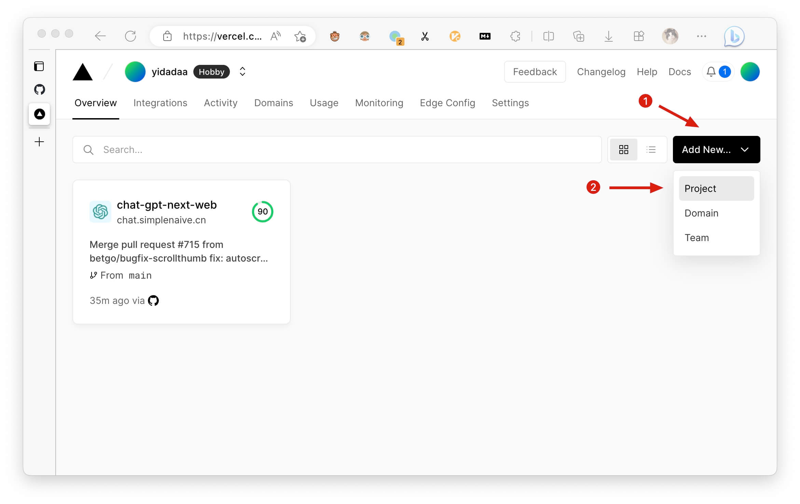
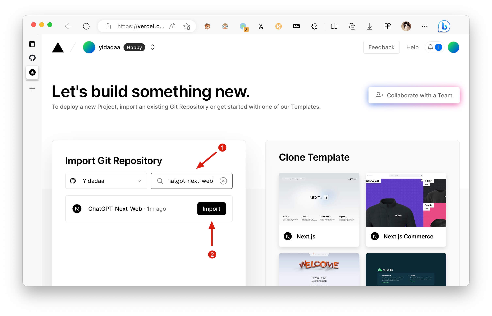
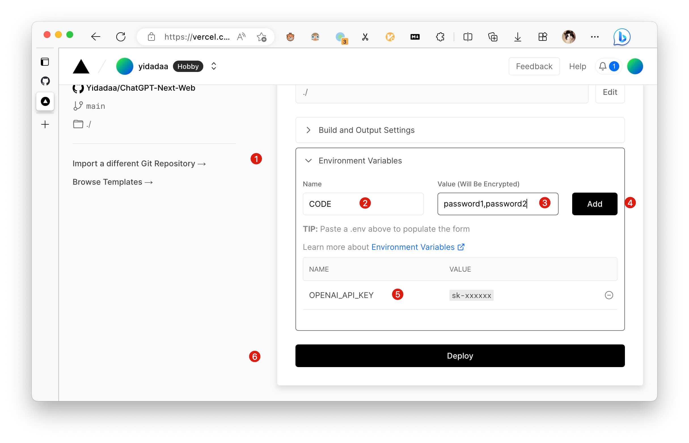
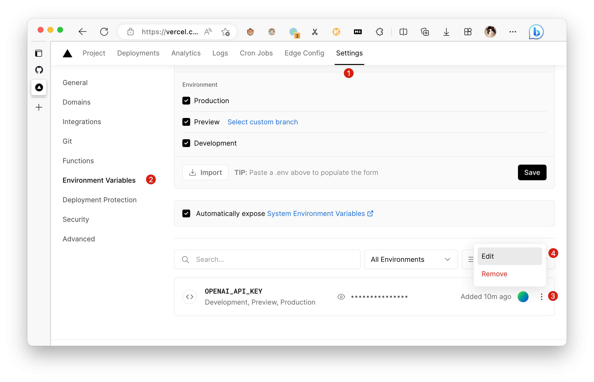
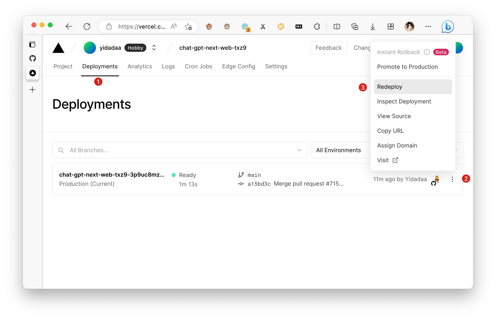

# Vercel Deployment Guide

## How to Create a New Project

If you forked this project from GitHub and need to redeploy it on Vercel, you need to create a new Vercel project and follow these steps:

1. Go to the Vercel console home page
2. Click "Add New"
3. Select "Project"

1. Search for "chatgpt-next-web" in the Git repository import section
2. Select your newly forked project and click "Import"

1. On the Project Settings page, click "Environment Variables" to set up environment variables
2. Add environment variables named `OPENAI_API_KEY` and `CODE`
3. Enter the corresponding values for the environment variables
4. Click "Add" to confirm adding the environment variable
5. Make sure to add `OPENAI_API_KEY`, otherwise it will not work
6. Click "Deploy" to complete the domain name generation, and wait approximately 5 minutes for the deployment to complete

## How to Add a Custom Domain Name

[TODO]

## How to Change Environment Variables

1. Go to the Vercel project internal console and click the "Settings" button at the top
2. Click "Environment Variables" on the left side
3. Click the button on the right side of the existing item
4. Select "Edit" to modify and save

⚠️ Note: Every time you change environment variables, you need to [redeploy the project](#how-to-redeploy) for the changes to take effect!

## How to Redeploy

1. Go to the Vercel project internal console and click the "Deployments" button at the top
2. Select the button on the right side of the top item in the list
3. Click "Redeploy" to redeploy
